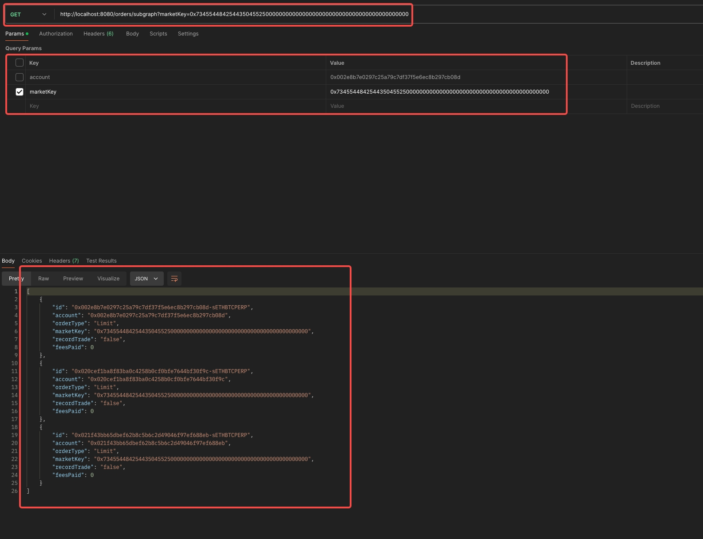

# About the Project

## Instructions to run the application

- Download the zip from the github or clone the project 
- Make sure you keep port 8080  free 
- Go to the root directory in the mac terminal or VS Code terminal 
- Create the .env file on root with the database config details something like below

    1. `touch .env`
    2. `vi .env`
    3. Add below content with the details of your Postgres database 

        ```
        DB_HOST=localhost
        DB_PORT=5432
        DB_USERNAME=your_user
        DB_PASSWORD=your_password
        DB_NAME=your_database
        ```
    4. For Mac / Linux run below commands on root directory
         `npm run install-and-start`
    5. Image showing commands 

## Technologies Involved 

- Typescript
- PostgreSQL
- Web3
- OP Mainnet
- Express - node js web application framework

## Basic Implementation

- This project is an implementation to read the Limit orders from OP Mainnet using Subgraph Implementation as well as read the conditional orders from the OP Mainnet chain using the BlocksNumbers
- Adding the orders in PostgreSQL database

## Subgraph Implementation (Demo URL's provided for all filters)

- The endpoint to read orders that are fetched from subgraph on the basis of Market key and account as filter is  http://localhost:8080/orders/subgraph
    1. When no filter is used http://localhost:8080/orders/subgraph  
    2. When account filter is applied http://localhost:8080/orders/subgraph?account=0x002e8b7e0297c25a79c7df37f5e6ec8b297cb08d  
    3. When Market filter is applied http://localhost:8080/orders/subgraph?marketKey=0x7345544842544350455250000000000000000000000000000000000000000000 
    4. When both account and marketKey filters are applied http://localhost:8080/orders/subgraph?account=0x002e8b7e0297c25a79c7df37f5e6ec8b297cb08d&marketKey=0x7345544842544350455250000000000000000000000000000000000000000000  


## Chain Implementation (Demo URL's provided for all filters)
- The endpoint to read orders that are fetched from subgraph on the basis of Market key and account as filter is  http://localhost:8080/orders/chain
    1. When No filter is used http://localhost:8080/orders/chain 
    2. When account filter is applied http://localhost:8080/orders/chain?account=0x04517Fb31B13188c8B81F5d4AfB0659de62aab04 
    3. When Market filter is applied http://localhost:8080/orders/chain?marketKey=0x7342544350455250000000000000000000000000000000000000000000000000 
    4. When both account and marketKey filters are applied http://localhost:8080/orders/chain?account=0x04517Fb31B13188c8B81F5d4AfB0659de62aab04&marketKey=0x7342544350455250000000000000000000000000000000000000000000000000 


## Questions to answer in README.md 

1. Write out or write pseudocode on how you would handle order execution to a blockchain like Optimism. Please be specific about the transaction queue, nonce ordering, and handling of gas fees.
2. Eventually checking all orders every block becomes unsustainable as the number of orders placed grows linearly. How would you optimize validity checking that way orders can be executed efficiently? - implement price filter


## Answers 

### 1. Handling Order Execution to a Blockchain like Optimism

Handling order execution involves several key steps: managing a transaction queue, ensuring nonce ordering, and handling gas fees.

#### Pseudocode for Handling Order Execution

- Manage a Transaction Queue:
    1. Create a queue to hold the transactions.
    2. Ensure the queue processes transactions in order.

- Nonce Ordering:
    1. Fetch the current nonce for the account executing the transactions.
    2. Ensure transactions are sent with increasing nonces.

- Gas Fees:
    1. Calculate and set appropriate gas fees for each transaction.
    2. Handle potential out-of-gas scenarios.

#### Approximate Implementation

```TypeScript
interface Transaction {
    orderId: string;
    account: string;
    marketKey: string;
    sizeDelta: string;
    desiredFillPrice: string;
    nonce: number;
}

class TransactionQueue {
    private queue: Transaction[] = [];
    private currentNonce: number | null = null;

    constructor(private accountAddress: string) {}

    async init() {
        this.currentNonce = await web3.eth.getTransactionCount(this.accountAddress, 'pending');
    }

    addTransaction(transaction: Transaction) {
        this.queue.push(transaction);
        this.queue.sort((a, b) => a.nonce - b.nonce);
    }

    async processQueue() {
        while (this.queue.length > 0) {
            const tx = this.queue.shift();
            if (tx) {
                await this.sendTransaction(tx);
            }
        }
    }

    private async sendTransaction(tx: Transaction) {
        if (this.currentNonce === null) {
            throw new Error('Nonce is not initialized.');
        }

        const txConfig: TransactionConfig = {
            from: this.accountAddress,
            to: CONTRACT_ADDRESS,
            data: this.createTransactionData(tx),
            nonce: this.currentNonce,
            gas: await this.estimateGas(tx),
            gasPrice: await web3.eth.getGasPrice(),
        };

        try {
            const receipt = await web3.eth.sendTransaction(txConfig);
            console.log(`Transaction for orderId ${tx.orderId} successful:`, receipt);
            this.currentNonce++;
        } catch (error) {
            console.error(`Transaction for orderId ${tx.orderId} failed:`, error);
        }
    }

    private createTransactionData(tx: Transaction): string {
        return web3.eth.abi.encodeFunctionCall({
            name: 'executeOrder',
            type: 'function',
            inputs: [
                { type: 'address', name: 'account' },
                { type: 'bytes32', name: 'marketKey' },
                { type: 'uint256', name: 'sizeDelta' },
                { type: 'uint256', name: 'desiredFillPrice' },
            ],
        }, [tx.account, tx.marketKey, tx.sizeDelta, tx.desiredFillPrice]);
    }

    private async estimateGas(tx: Transaction): Promise<number> {
        return await web3.eth.estimateGas({
            from: this.accountAddress,
            to: CONTRACT_ADDRESS,
            data: this.createTransactionData(tx),
        });
    }
}

// Usage example:
(async () => {
    const txQueue = new TransactionQueue('YOUR_ACCOUNT_ADDRESS');
    await txQueue.init();
    txQueue.addTransaction({
        orderId: '1',
        account: '0xAccount',
        marketKey: '0xMarketKey',
        sizeDelta: '1000',
        desiredFillPrice: '500',
        nonce: txQueue.currentNonce!,
    });
    txQueue.processQueue();
})();

```
### 2. Optimizing Validity Checking for Efficient Order Execution

To optimize validity checking, you can implement a price filter to reduce the number of orders checked on each block.

- Storing Orders by Price Range:
    1. Index orders by their target price range.
    2. Only check orders within the relevant price range based on current market conditions.

- Efficient Order Retrieval:
    1. Use a data structure like a binary search tree or a sorted list to quickly retrieve orders within a specific price range.

#### Explanation:

`checkOrdersForExecution:`

- Filters orders based on a price range derived from the current market price.
- Only checks orders within the relevant price range for execution readiness.


`calculatePriceRange:`

- Calculates a price range around the current market price using a tolerance percentage.


`getOrdersWithinPriceRange:`

- Retrieves orders from the database that fall within the specified price range.

`isOrderReadyForExecution:`

- Simulates order execution using estimateGas to determine if the order can be executed.


```TypeScript
class PriceFilteredOrderChecker {
    private orderRepository = AppDataSource.getRepository(ConditionalOrder);

    async checkOrdersForExecution(currentMarketPrice: string): Promise<void> {
        const priceRange = this.calculatePriceRange(currentMarketPrice);
        const ordersToCheck = await this.getOrdersWithinPriceRange(priceRange.min, priceRange.max);

        for (const order of ordersToCheck) {
            const isReadyForExecution = await this.isOrderReadyForExecution(order);
            if (isReadyForExecution) {
                order.readyForExecution = true;
                await this.orderRepository.save(order);
                console.log(`Order with orderId ${order.orderId} is ready for execution.`);
            }
        }
    }

    private calculatePriceRange(currentMarketPrice: string): { min: string, max: string } {
        const price = parseFloat(currentMarketPrice);
        const tolerance = 0.05; // 5% price tolerance
        const min = (price * (1 - tolerance)).toFixed(2);
        const max = (price * (1 + tolerance)).toFixed(2);
        return { min, max };
    }

    private async getOrdersWithinPriceRange(minPrice: string, maxPrice: string): Promise<ConditionalOrder[]> {
        return await this.orderRepository.find({
            where: {
                targetPrice: Between(minPrice, maxPrice),
                readyForExecution: false,
            }
        });
    }

    private async isOrderReadyForExecution(order: ConditionalOrder): Promise<boolean> {
        const { account, marketKey, sizeDelta, desiredFillPrice } = order;

        const callData = this.contractInstance.methods.executeOrder(
            account,
            marketKey,
            sizeDelta,
            desiredFillPrice
        ).encodeABI();

        try {
            const gasEstimate = await web3.eth.estimateGas({
                to: CONTRACT_ADDRESS,
                data: callData
            });

            return gasEstimate !== undefined;
        } catch (error) {
            console.warn(`Order with orderId ${order.orderId} is not ready for execution.`, error);
            return false;
        }
    }
}

// Usage example:
const priceChecker = new PriceFilteredOrderChecker();
setInterval(async () => {
    const currentMarketPrice = await getCurrentMarketPrice(); // Implement this function to get the current market price
    await priceChecker.checkOrdersForExecution(currentMarketPrice);
}, 60000); // Check every minute
```

This approach optimizes order checking by reducing the number of orders evaluated on each block, making the process more scalable as the number of orders grows.

### Screenshot of Database tables

#### order


#### conditional_order


### Adding the screenshot of my Alchemy dashboard for total requests

